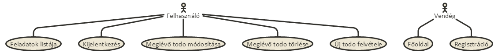
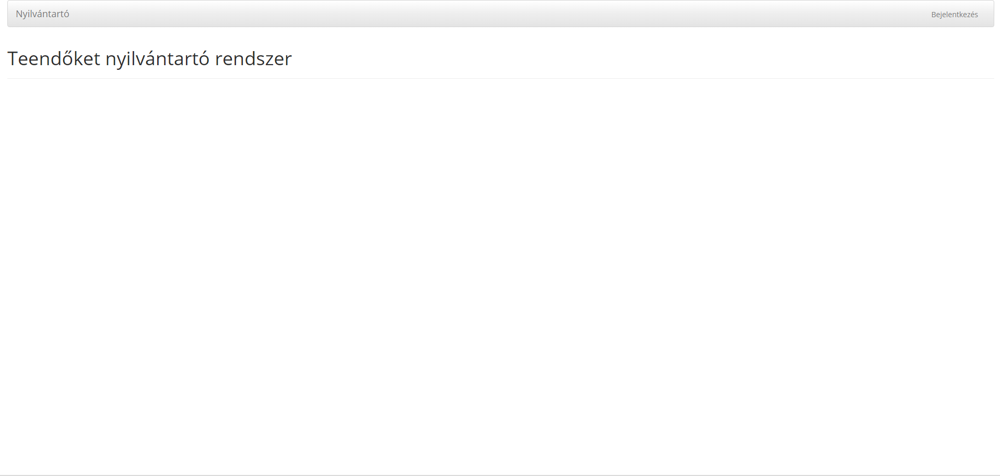
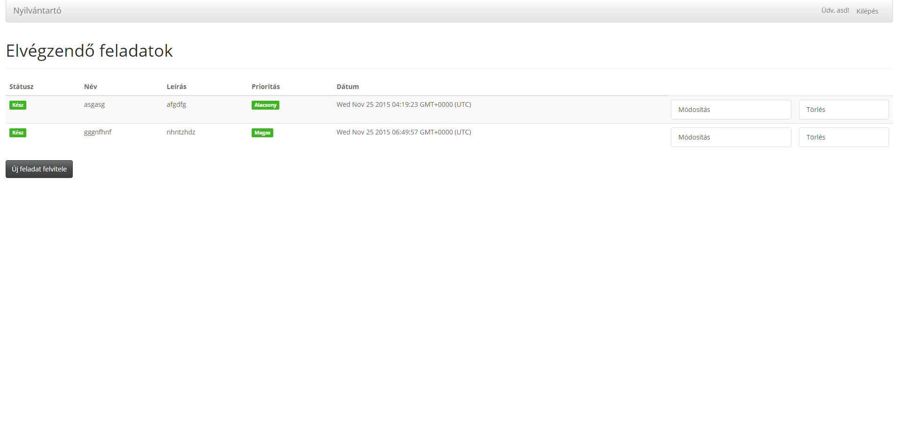
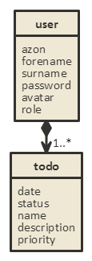
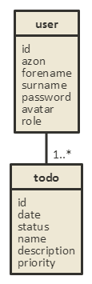
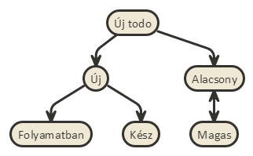
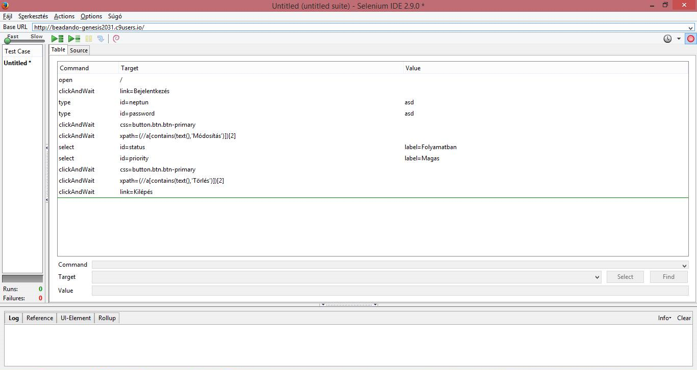

#Feladatkezelő rendszer

##Követelmények:

1. Követelmények összegyűjtése

    + a rendszer személyes felhasználóknak készült, hogy nyilvántarthassák elvégzendő feladataikat
    + megtekinthető a felvitt feladatok listája
    + a felhasználó módosíthatja az elemeket: újakat vehet fel, módosíthat ill. törölhet

2. Használatieset-modell
    - Szerepkörök:
        + vendég: kezdőoldal megtekintése, regisztráció
        + felhasználó: feldatlista megtekintése, új feladat felvétele, meglévő szerkesztése (név, leírás, prioritás, státusz), törlése
    
    - Használati eset diagram:
        
    

##Tervezés

    
1. Oldaltérkép
    
    + Publikus:
        
      - főoldal
  		- regisztráció
      - bejelentkezés
        
    + Felhasználó
        
      - feladatok listjája
      - új feladat felvétele
      - meglévő feladat módosítása
      - meglévő feladat törlése

2. Oldalvázlatok
    
    
    

4. Osztálymodell
    - Adatmodell
    
        

    - Adatbázisterv
    
        
        
    - Állapotdiagram
    
        

##Tesztelés

	- Selenium IDE segítségével
	- Egy adott listaelem módosítása, majd törlése után a teszt az alábbi eredménnyel zárult:

	

